id: aca-012025-taller-2
summary: Taller 1 - Control de versioines y buenas prácticas
categories: git, version control
status: Published
authors: Metzi Aguilar, David Garcia, Erika Paz, Kevin Escobar

# Taller 2 - Control de Versiones y Buenas Prácticas con Git

<!-- ------------------------ -->

## Prerrequisitos

Antes de comenzar con el taller, es fundamental asegurarse de que tienes instaladas y configuradas las herramientas necesarias. A continuación, se detallan los pasos para la instalación y configuración inicial de Git y Node.js.

### Instalación de Git

Para utilizar Git, primero debes instalarlo en tu sistema. Git está disponible para múltiples plataformas, incluyendo Windows, macOS y Linux. Puedes descargarlo desde el [sitio oficial de Git](https://git-scm.com/downloads) y seguir las instrucciones de instalación específicas para tu sistema operativo. Asegúrate de que Git esté correctamente instalado ejecutando el siguiente comando en tu terminal:

```bash
git --version
```

Este comando debería mostrar la versión de Git instalada en tu sistema. Si no ves la versión, revisa el proceso de instalación.

<!-- ------------------------ -->

## Introducción a Codeberg

[Codeberg](https://codeberg.org) es una plataforma de alojamiento de código fuente basada en **Gitea**, una alternativa libre y de código abierto a servicios como GitHub o GitLab. Su principal objetivo es ofrecer un entorno sin publicidad, orientado a la comunidad y enfocado en el desarrollo de software libre.

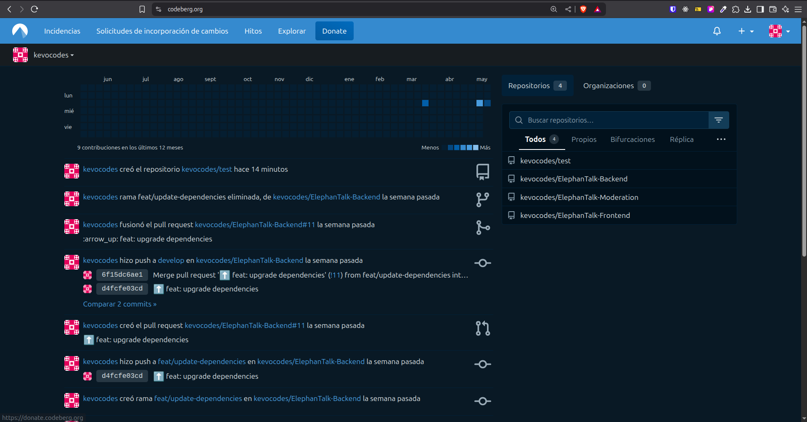

### 🛠️ Características principales

- Repositorios públicos y privados
- Sistema de issues y pull requests
- Wikis y páginas del proyecto
- Integración continua y automatización (CI/CD)
- Interfaz amigable basada en Gitea

---

### Registro en Codeberg

#### 1. Crear cuenta

1. Ve a [https://codeberg.org](https://codeberg.org)
2. Haz clic en **"Sign Up"**
3. Completa los campos:
   - `Username`: nombre de usuario único
   - `Email`: correo electrónico válido
   - `Password`: contraseña segura
4. Acepta los términos de servicio y completa el captcha
5. Haz clic en **"Register"**

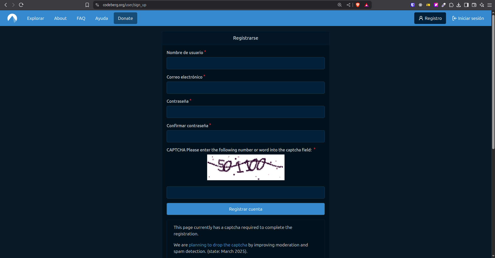

#### 2. Verificar tu cuenta

- Revisa tu correo y haz clic en el enlace de verificación para activar la cuenta.

---

### Crear y Gestionar Repositorios

#### 1. Crear un nuevo repositorio

1. Una vez dentro, haz clic en **"New Repository"**
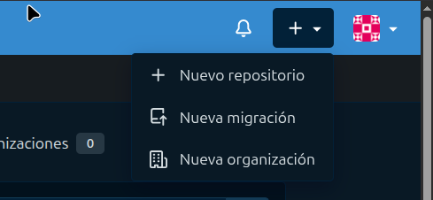

2. Rellena los datos: nombre del repositorio, descripción, visibilidad, etc.
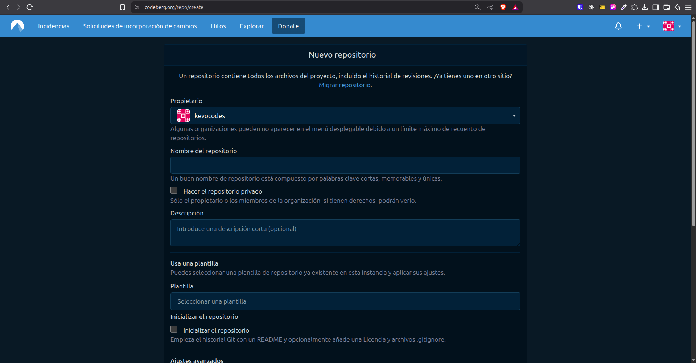

3. Puedes inicializar el repositorio con un archivo `README`, `.gitignore` o una licencia.
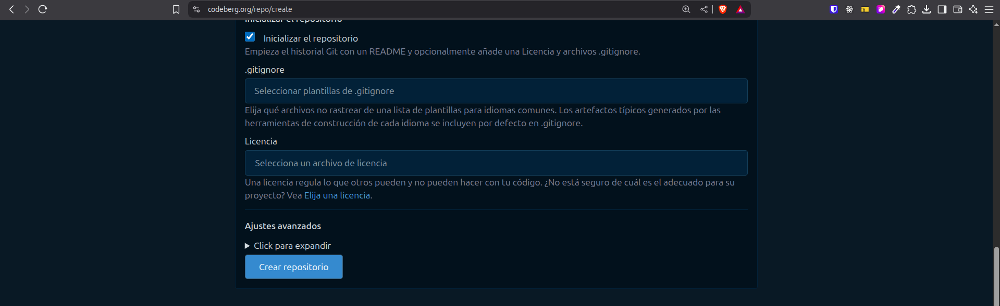

4. Clic en **"Create Repository"**

#### 2. Configuración del repositorio

Accede al repositorio:
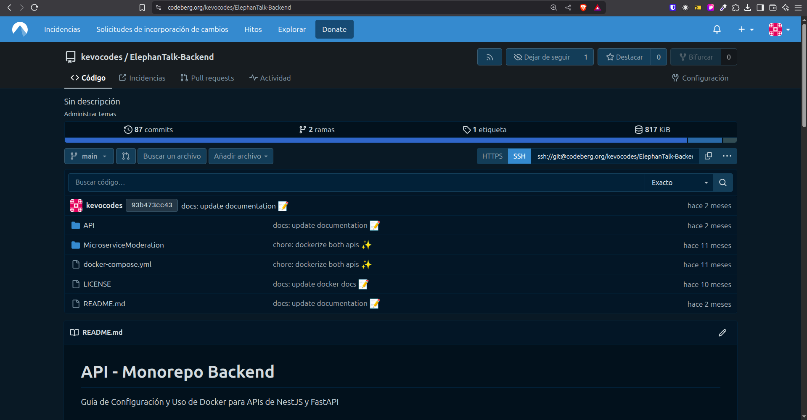


Desde la pestaña **"Settings"** podrás:

- Añadir colaboradores (`Collaborators`)
- Configurar ramas (`Branches`)
- Añadir webhooks (`Webhooks`)
- Habilitar Wiki y Páginas del Proyecto

---

### Uso de Git con Codeberg

#### 1. Configuración inicial

Configura tu identidad en Git (si aún no lo has hecho):

```bash
git config --global user.name "Tu Nombre"
git config --global user.email "tu.email@ejemplo.com"
```

#### 2. Clonar un repositorio

Copia la URL HTTPS desde Codeberg y clona el repositorio:

```bash
git clone https://codeberg.org/tu_usuario/tu_repositorio.git
```

#### 3. Enviar cambios al repositorio

```bash
git add .
git commit -m "feat: cambios importantes"
git push origin main
```

---

### Colaboración en Codeberg

#### Issues

1. Entra a la pestaña **"Issues"** de tu repositorio
2. Haz clic en **"New Issue"**
3. Describe el problema o sugerencia

#### Pull Requests

1. Crea una rama (`feature/nueva-funcionalidad`)
2. Haz tus cambios y súbelos
3. Desde Codeberg, crea un Pull Request de tu rama hacia `main` o `develop`
4. Comenta, discute y revisa los cambios con tus compañeros

---

### Automatización e Integraciones

#### Integración Continua (CI)

Puedes configurar workflows CI/CD utilizando archivos `.yml`, por ejemplo, con GitHub Actions, Drone, Travis CI, etc.

- Crear archivo `.github/workflows/deploy.yml` (o el sistema que prefieras)
- Automatiza pruebas, builds o despliegues

#### Webhooks y API

- Desde la pestaña **"Settings" > "Webhooks"** puedes integrar servicios externos
- También puedes usar la [API de Codeberg](https://codeberg.org/api/swagger) para automatizar tareas

---

### Wikis y Páginas de Proyecto

- Habilita el Wiki desde **"Settings"**
- Documenta tu proyecto, instalación, uso, etc.
- Para alojar una web del proyecto (como GitHub Pages), configura la opción correspondiente o usa un workflow de CI que haga el despliegue

---

### Comunidad y Soporte

- Documentación: [https://docs.codeberg.org](https://docs.codeberg.org)
- Comunidad y contribución: [https://codeberg.org/Codeberg/Contributing](https://codeberg.org/Codeberg/Contributing)
- Soporte técnico: Accesible desde tu cuenta de Codeberg o foros abiertos

---

## Migrar Repositorio a Codeberg

Codeberg permite realizar **migraciones automáticas** desde otras forjas como GitHub, GitLab o Bitbucket mediante su asistente de importación.

A continuación, se detalla el procedimiento paso a paso para migrar un repositorio existente:

---

### 1. Iniciar el proceso de migración

Desde tu perfil en Codeberg:

- Dirígete al menú superior y selecciona **"New Migration"**

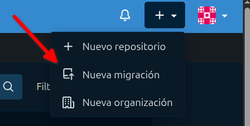

---

### 2. Seleccionar la forja de origen

- Elige la plataforma de donde migrarás el repositorio (por ejemplo, GitHub)

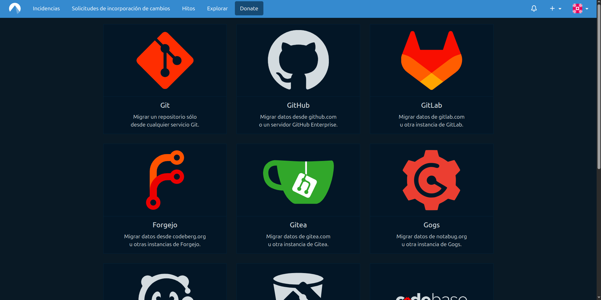

---

### 3. Llenar el formulario de migración

Completa los siguientes campos en el formulario:

- **Clone address (URL del repositorio original)**  
  Ejemplo: `https://github.com/usuario/repositorio.git`

- **Access token**  
  Genera un token de acceso personal en tu cuenta de GitHub con permisos de lectura. Puedes crearlo desde: [https://github.com/settings/tokens](https://github.com/settings/tokens)

- **Migrate the following items**  
  Marca lo que deseas migrar: código, issues, wiki, pull requests, etc.

- **Owner**  
  Selecciona tu usuario de Codeberg o una organización en la que participes.

- **Repository name**  
  El nombre del nuevo repositorio en Codeberg.

- **Visibility**  
  Elige si el repositorio será público o privado.

- **Description** (opcional)  
  Breve descripción del proyecto.

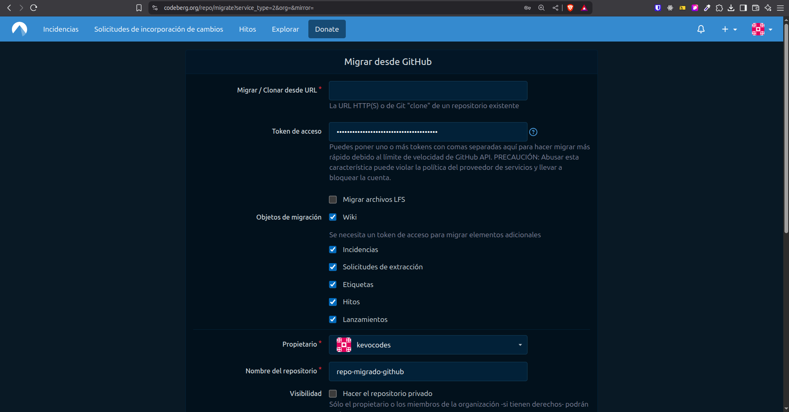

---

### 4. Ejecutar la migración

Haz clic en **"Migrate Repository"** para iniciar el proceso.

> ⏳ La migración puede tardar unos minutos dependiendo del tamaño y elementos seleccionados.

---

### ✅ Verificación post-migración

Una vez completada la migración, revisa tu nuevo repositorio en Codeberg:

- Archivos y commits
- Issues y pull requests (si fueron migrados)
- Wiki (si estaba activado)
- Etiquetas (tags) y ramas

---

### 🔐 Sobre el Access Token de GitHub

Para generar un token de acceso personal en GitHub:

1. Ve a [https://github.com/settings/tokens](https://github.com/settings/tokens)
2. Haz clic en **"Generate new token"**
3. Elige un nombre, define una expiración y selecciona estos scopes mínimos:
   - `repo` (lectura de repositorios privados, si aplica)
   - `read:org` (si el repositorio pertenece a una organización)
4. Copia y guarda el token. No podrá ser visto nuevamente.

---

### 📝 Recomendaciones finales

- Si no migraste elementos como *issues* o *wiki*, puedes exportarlos manualmente.
- Verifica los permisos de colaboradores después de la migración.
- Actualiza cualquier referencia o URL antigua en el `README.md`.

---

### Recursos útiles

- Documentación oficial de Codeberg: [https://docs.codeberg.org](https://docs.codeberg.org)
- Contribuir al proyecto Codeberg: [https://codeberg.org/Codeberg/Contributing](https://codeberg.org/Codeberg/Contributing)


---

## Agregar una Licencia en Codeberg

Toda obra de software debería incluir una licencia que indique claramente qué pueden (y no pueden) hacer otros usuarios con tu código. Codeberg, al estar basado en Gitea, ofrece soporte para añadir licencias al momento de crear un repositorio, y también puedes hacerlo de forma manual para repositorios ya existentes.

---

### 🔧 1. Agregar licencia al crear un nuevo repositorio

Cuando creas un nuevo repositorio desde Codeberg:

1. Accede a [https://codeberg.org](https://codeberg.org) y haz clic en **"New Repository"**.
2. Llena los campos requeridos (nombre, descripción, visibilidad).
3. En la sección **"Initialize this repository"**, da clic en el input **"Choose a license"**.
4. Selecciona la licencia que desees (MIT, GPLv3, Apache 2.0, etc.)
5. Finaliza haciendo clic en **"Create Repository"**

Esto generará automáticamente un archivo `LICENSE` en la raíz de tu proyecto.

> ✅ Esta es la forma recomendada, ya que queda registrada desde el inicio.

---

### 📝 2. Agregar o cambiar la licencia en un repositorio existente

Si ya tienes un repositorio en Codeberg sin licencia, puedes agregarla fácilmente de forma manual:

#### Opción A – Desde la interfaz web de Codeberg

1. Ve a tu repositorio
2. Haz clic en **"Add file" > "Create new file"**
3. Nombra el archivo como:

```text
LICENSE
```

4. Pega el contenido de la licencia elegida puedes obtener plantillas desde [https://choosealicense.com](https://choosealicense.com)

5. Agrega un mensaje de confirmación, por ejemplo: "docs: agregar archivo LICENSE"

6. Haz clic en "Commit changes"

---


## Manejo de *issues*

Para comenzar con el manejo de *issues* en Codeberg, primero es necesario **crear un proyecto** que sirva como tablero de control para su seguimiento.

### 1. Activar la opción de proyectos en el repositorio

1. Dirígete al repositorio correspondiente y accede a la **Configuración**.

   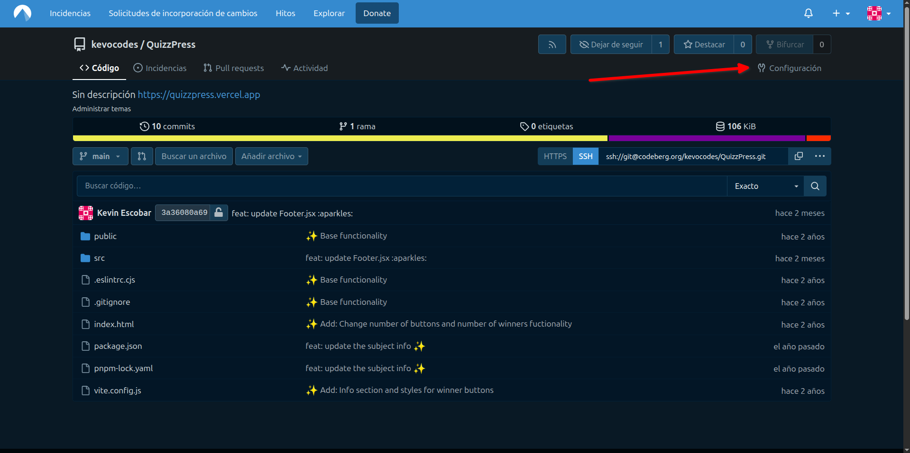

2. En el menú lateral, selecciona **Unidades > Vista general**.

   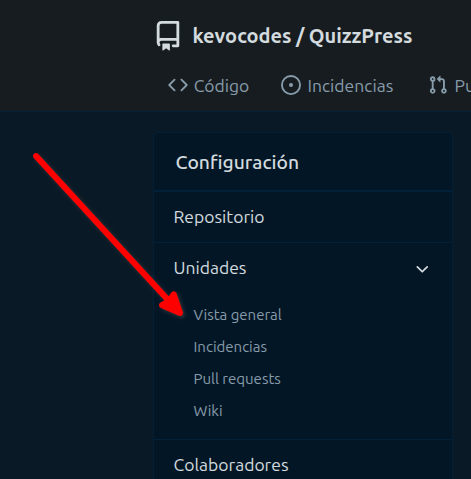

3. Marca la casilla **"Activar proyectos en el repositorio"**.

   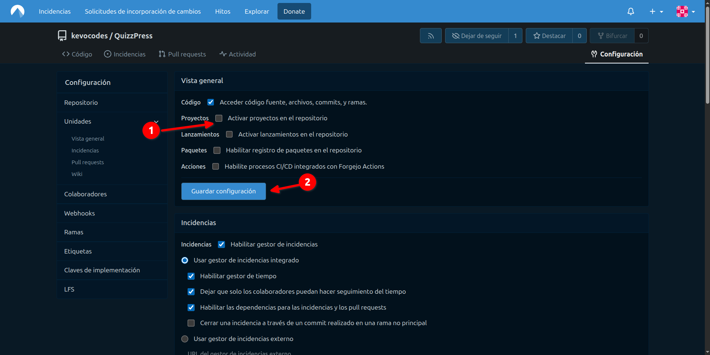

4. Una vez activada esta opción, aparecerá una nueva pestaña llamada **Proyectos** en la parte superior del repositorio.

   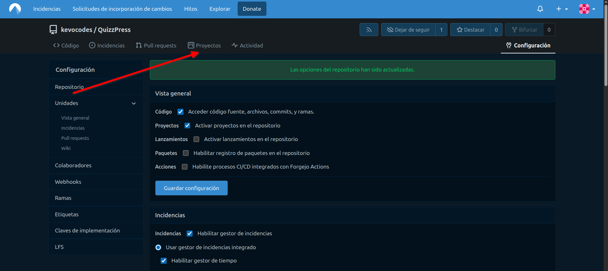

### 2. Crear un nuevo proyecto

1. Haz clic en **"Nuevo proyecto"** dentro de la sección de proyectos.

   

2. Completa el formulario ingresando:
   - **Nombre del proyecto**
   - **Descripción**
   - En la opción **Plantilla**, selecciona **"Kanban básico"**

   Finalmente, haz clic en **"Crear proyecto"**.

   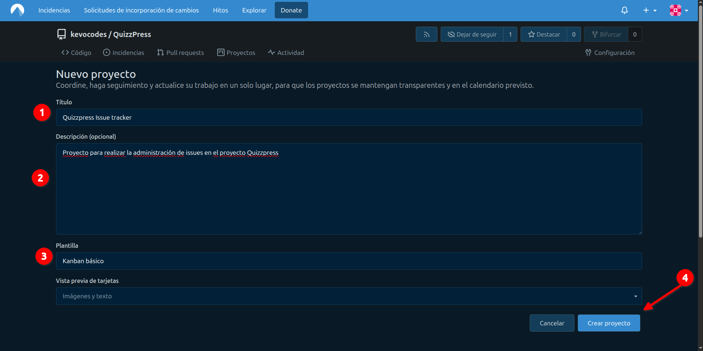


### Creación y gestión de *issues*

Una vez creado el proyecto, el siguiente paso es registrar los *issues* correspondientes. Para ello:

1. Accede a la pestaña **Issues > New Issue** (*Incidencias > Nueva incidencia*).

   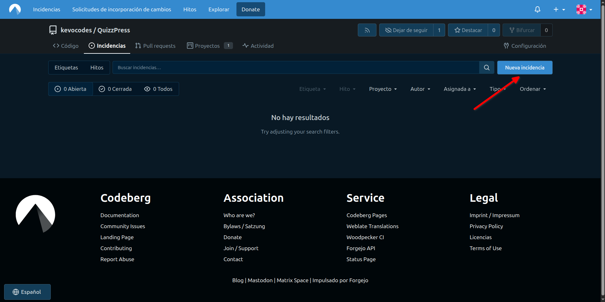

2. Completa los siguientes campos:
   - **Title**: Título del *issue*
   - **Description**: Breve explicación del problema o tarea
   - **Assignees**: Persona a quien se le asignará
   - **Labels**: Tipo de *issue* (por ejemplo: *bug*, *enhancement*)
   - **Projects**: Tablero al que se agregará el *issue*

   En el siguiente ejemplo, se crea un *issue* con esta configuración:
   - Título: *Bug ejemplo*
   - Descripción: *Bug descripción ejemplo*
   - Asignado a: el propio autor
   - Tablero: el proyecto recién creado para seguimiento de errores

   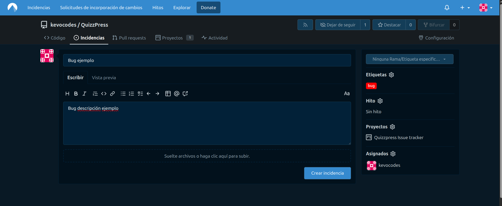

<aside class="negative">
⚠️ Si no aparecen etiquetas disponibles (labels), dirígete a la sección principal de Issues en tu repositorio, haz clic en el botón "Labels", selecciona el conjunto de etiquetas predefinido y luego haz clic en "Use this preset" para habilitarlas.
</aside>

---

Una vez creado, el *issue* será visible en la lista y se mostrará también dentro del tablero correspondiente:


El *issue* ya estará asignado al proyecto:

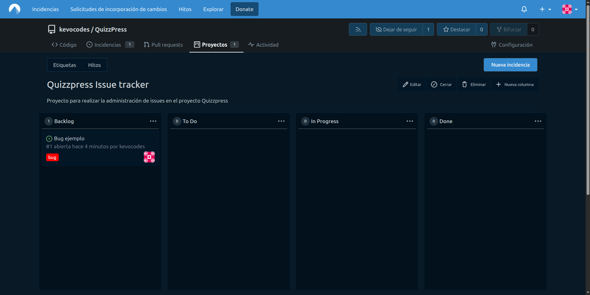

Cada movimiento dentro del tablero (por ejemplo, avanzar de "To do" a "In progress") se reflejará automáticamente en el *issue* relacionado. Una vez que se resuelva el *issue*, debe moverse a la columna **Done** y marcarse como cerrado.

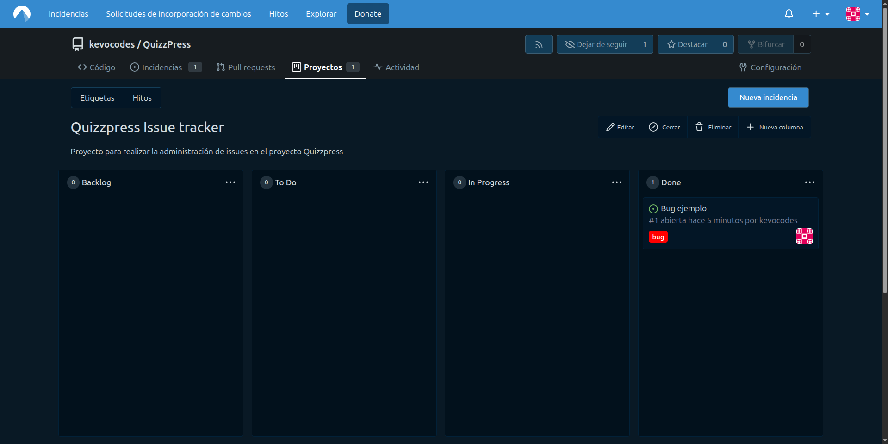

Posteriormente, se puede cerrar el *issue* seleccionando la opción **"Close issue"**.

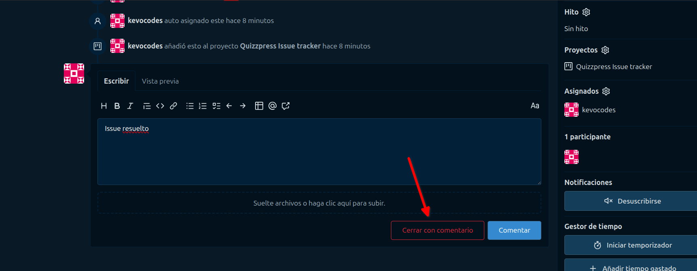
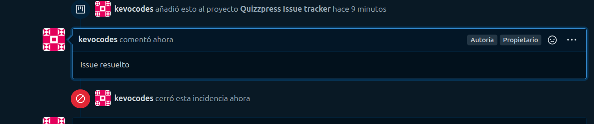

---

### Puntos recomendados para documentar los *issues*

Al documentar un *issue*, se recomienda utilizar los siguientes puntos para mantener un formato claro y uniforme:

```md
## Descripción del problema
Breve descripción del problema que se ha identificado y se ha resuelto.

## Detalles técnicos
- Puntos o detalles técnicos que se tomaron en cuenta que influyen en el problema
- Tiene que ir en formato de lista

## Reproducción del problema
Para reproducir el problema se deben seguir los siguientes pasos:
- Paso 1
- Paso 2
- Paso 3

## Causas
- Definir las causas que ocasionaban el problema en formato de lista

## Acciones tomadas
- Definir cuáles fueron las acciones que se tomaron para resolver el problema

## Resultados de las acciones
- Definir que sucedió luego de tomar las acciones, los resultados

## Consideraciones
- Cosas que se deben tomar en cuenta para evitar futuros problemas similares
```

---

A continuación se muestran ejemplos de un *issue* documentado y cerrado exitosamente:

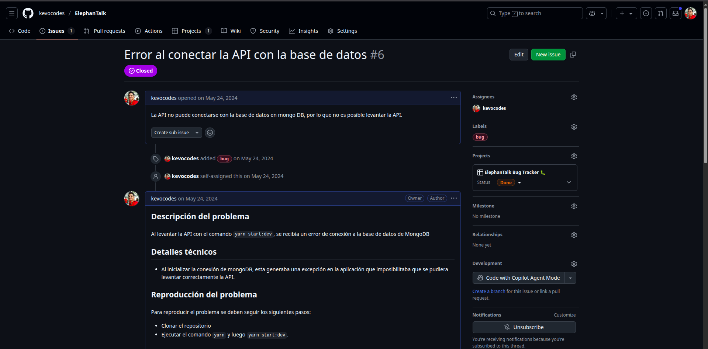  


<aside class="negative">
⚠️ Aunque el ejemplo proviene de GitHub, lo importante es mantener una estructura clara en los comentarios y documentación del issue.
</aside>

<!-- ------------------------ -->

## Control de versiones - Uso Básico de Git


El control de versiones es una práctica fundamental en el desarrollo de software moderno, ya que permite a los equipos gestionar y rastrear los cambios en el código fuente a lo largo del tiempo. Git, una de las herramientas más populares para el control de versiones, ofrece una serie de funcionalidades que facilitan la colaboración entre desarrolladores, la gestión de proyectos y la recuperación de versiones anteriores del código.

En esta sección aprenderás los fundamentos para trabajar con Git en tu entorno local y conectarlo con plataformas como GitHub, GitLab o Bitbucket. Esta base te permitirá mantener un historial claro de tus cambios y colaborar efectivamente en proyectos de desarrollo.

### 1. Configuración Inicial

Antes de comenzar a trabajar con Git, debes configurar tus credenciales de usuario. Esto es importante porque cada cambio que registres en un repositorio tendrá tu nombre y correo asociado.

```bash
git config --global user.name "Tu Nombre"
git config --global user.email "tu.email@ejemplo.com"
```

Verifica la configuración actual con:

```bash
git config --list
```

> 💡 Usa `--global` para que la configuración aplique a todos tus proyectos. Si quieres una configuración específica para un solo repositorio, omite el flag `--global`.

---

### 2. Inicializar un Repositorio

Para empezar a trabajar con Git en un proyecto local, navega a la carpeta del proyecto y ejecuta:

```bash
git init
```

Esto crea una carpeta oculta `.git/` donde se almacenará toda la información de versiones.

---

### 3. Agregar un Repositorio Remoto (GitHub u otra forja)

Una vez creado tu repositorio local, puedes conectarlo con un repositorio remoto (por ejemplo, de GitHub). Primero, crea un nuevo repositorio desde la plataforma que prefieras (GitHub, GitLab, etc.), **sin seleccionar la opción de crear README ni `.gitignore` si ya iniciaste el repositorio localmente.**

Luego, enlaza tu repositorio local con el remoto:

```bash
git remote add origin https://github.com/usuario/nombre-repo.git
```

Verifica que se haya agregado correctamente:

```bash
git remote -v
```

---

### 4. Flujo de Trabajo Básico en Git

A continuación, se describe el flujo más común para trabajar con Git en el día a día:

#### a. Verificar el estado del repositorio

```bash
git status
```

#### b. Agregar archivos al área de preparación (staging)

```bash
git add .
```

Puedes agregar archivos específicos con:

```bash
git add archivo.js
```

#### c. Hacer un commit

```bash
git commit -m "feat: agregar funcionalidad inicial"
```

> 💡 Usa mensajes significativos siguiendo una convención clara (por ejemplo, [Conventional Commits](https://www.conventionalcommits.org/es/v1.0.0/)) para mantener un historial legible.

#### d. Subir cambios al repositorio remoto

```bash
git push origin main
```

> Si estás usando otra rama como `develop`, reemplaza `main` por el nombre de la rama correspondiente.

#### e. Obtener los últimos cambios del remoto

```bash
git pull origin main
```

Esto es útil cuando varios colaboradores están trabajando en el mismo proyecto.

---

### 5. Crear y Cambiar de Rama

Trabajar con ramas permite aislar funcionalidades y mantener la rama principal libre de código en desarrollo.

```bash
git checkout -b feature/nueva-funcionalidad
```

Para cambiar entre ramas:

```bash
git checkout develop
```

---

### 6. Subir una Nueva Rama al Remoto

Una vez creada una nueva rama local y añadidos tus cambios, debes subirla al repositorio remoto:

```bash
git push -u origin feature/nueva-funcionalidad
```

El flag `-u` establece un "seguimiento" entre la rama local y la rama remota para futuros `git push` sin argumentos.

---

### 7. Visualizar el Historial de Commits

Puedes ver el historial con:

```bash
git log --oneline --graph --all
```

Este comando muestra los commits de forma compacta y visualiza la estructura de ramas.

---

### 8. Clonar un Repositorio Existente

Si deseas trabajar con un repositorio existente desde cero, usa:

```bash
git clone https://github.com/usuario/nombre-repo.git
```

Esto descargará todos los archivos del proyecto, incluidas sus versiones anteriores.

---

### 9. Buenas Prácticas

- ✅ **Haz commits frecuentemente:** Documenta cambios pequeños y coherentes.
- 🌿 **Trabaja con ramas:** Nunca desarrolles directamente en `main`.
- 🔄 **Sincroniza frecuentemente:** Usa `git pull` para evitar conflictos.
- 🧹 **Agrega un `.gitignore`:** Evita subir archivos innecesarios como `node_modules` o `.env`.


<!-- ------------------------ -->

## Gitflow

Gitflow es un modelo de ramificación (branching model) que proporciona un enfoque estructurado para el desarrollo de software utilizando Git. Este flujo de trabajo es especialmente útil en proyectos que requieren un ciclo de vida de desarrollo más complejo, como aquellos que involucran múltiples versiones y lanzamientos. Gitflow ayuda a los equipos a gestionar el desarrollo de nuevas características, correcciones de errores y lanzamientos de manera organizada y eficiente.

 

### Estructura de Gitflow

El modelo Gitflow se basa en dos ramas principales y varias ramas de soporte:

1. **Rama main (o master):** Esta rama contiene el código de producción. Cada commit en esta rama representa una versión estable del software que se puede desplegar.

2. **Rama develop:** Esta rama es donde se integra el trabajo de desarrollo. Contiene las últimas características y correcciones que están listas para ser probadas antes de ser lanzadas a producción.
 
3. **Ramas de características (feature):** Se crean a partir de la rama develop para desarrollar nuevas funcionalidades. Una vez que la característica está completa, se fusiona de nuevo en develop.

4. **Ramas de corrección de errores (hotfix)**: Se crean a partir de la rama main para abordar problemas críticos en producción. Después de realizar la corrección, se fusionan tanto en main como en develop.

5. **Ramas de lanzamiento (release):** Se crean a partir de develop cuando se está listo para preparar una nueva versión. Permiten realizar pruebas finales y correcciones antes de fusionar los cambios en main.

### Flujo de Trabajo de Gitflow

A continuación, se detalla el flujo de trabajo de Gitflow, dividido en tres secciones principales: trabajo con características (features), trabajo con lanzamientos (releases) y trabajo con correcciones de errores (hotfixes).

#### 1. Trabajo con Features

El desarrollo de nuevas características se realiza a través de ramas de características (feature branches). El flujo de trabajo es el siguiente:

1. **Crear la rama `develop` a partir de `main`**: Si aún no existe, inicializa la rama `develop` a partir de `main`:

   ```bash
   git checkout main
   git checkout -b develop
   ```

2. **Acceder a `develop` y crear una rama de características**: Cuando se comienza a trabajar en una nueva característica, crea una rama de características a partir de `develop`:

   ```bash
   git checkout develop
   git checkout -b feature/nueva-caracteristica
   ```

3. **Desarrollar la característica**: Realiza los cambios necesarios en la nueva rama. Asegúrate de hacer commits regulares para mantener un historial claro.

4. **Crear la Pull Request**: Una vez que la característica está completa y probada, crea un Pull Request (PR) en la plataforma de gestión de código (como GitHub, GitLab o Bitbucket) para solicitar la revisión y fusión de la rama de características en `develop`. Esto permite que otros miembros del equipo revisen el código y realicen comentarios antes de la fusión.

5. **Fusionar la característica a `develop`**: Después de que el Pull Request ha sido revisado y aprobado, se puede fusionar en `develop`. Esto se puede hacer a través de la interfaz de la plataforma de gestión de código, lo que garantiza que se mantenga un registro claro de los cambios.

#### 2. Trabajo con Releases

El proceso de lanzamiento de nuevas versiones del software se gestiona a través de ramas de lanzamiento (release branches). El flujo de trabajo es el siguiente:

1. **Acceder a `develop`**: Asegúrate de estar en la rama `develop`:

   ```bash
   git checkout develop
   ```

2. **Crear la rama de lanzamiento a partir de `develop`**: Cuando se está listo para preparar una nueva versión, crea una rama de lanzamiento:

   ```bash
   git checkout -b release/v1.0.0
   ```

3. **Preparar el lanzamiento**: Realiza pruebas finales y correcciones en la rama de lanzamiento. Asegúrate de que todo esté listo para la producción.

4. **Crear la Pull Request para incorporar los cambios a `main`**: Una vez que el lanzamiento está listo, crea un Pull Request para fusionar la rama de lanzamiento en `main`.

5. **Fusionar el lanzamiento a `main`**: Después de que el Pull Request ha sido revisado y aprobado, se puede fusionar en `main`. Esto representa la nueva versión de producción.

6. **Etiquetar la nueva versión de producción**: Después de fusionar, etiqueta la nueva versión en `main`:

   ```bash
   git checkout main
   git tag -a v1.0.0 -m "Lanzamiento de la versión 1.0.0"
   ```

7. **Crear la Pull Request para incorporar los cambios a `develop`**: Crea un Pull Request para fusionar la rama de lanzamiento de nuevo en `develop`, asegurando que los cambios de la versión se integren en el flujo de desarrollo.

8. **Fusionar el lanzamiento a `develop`**: Después de que el Pull Request ha sido revisado y aprobado, se puede fusionar en `develop`.

#### 3. Trabajo con Ramas de Corrección de Errores

Las correcciones de errores críticos en producción se gestionan a través de ramas de corrección de errores (hotfix branches). El flujo de trabajo es el siguiente:

1. **Acceder a `main`**: Asegúrate de estar en la rama `main`:

   ```bash
   git checkout main
   ```

2. **Crear la rama de corrección de errores**: Cuando se encuentra un error crítico en producción, crea una rama de corrección de errores a partir de `main`:

   ```bash
   git checkout -b hotfix/correccion-critica
   ```

3. **Corregir los errores**: Realiza los cambios necesarios para corregir el error.

4. **Crear la Pull Request para incorporar las correcciones a `main`**: Una vez que la corrección está completa, crea un Pull Request para fusionar la rama de corrección de errores en `main`.

5. **Fusionar la corrección a `main`**: Después de que el Pull Request ha sido revisado y aprobado, se puede fusionar en `main`. Esto actualiza la versión de producción con la corrección.

6. **Etiquetar la nueva versión de producción**: Después de fusionar, etiqueta la nueva versión en `main`:

   ```bash
   git checkout main
   git tag -a v1.0.1 -m "Corrección crítica en la versión 1.0.1"
   ```

7. **Crear la Pull Request para incorporar las correcciones a `develop`**: Crea un Pull Request para fusionar la rama de corrección de errores de nuevo en `develop`, asegurando que los cambios de la corrección se integren en el flujo de desarrollo.

8. **Fusionar las correcciones a `develop`**: Después de que el Pull Request ha sido revisado y aprobado, se puede fusionar en `develop`.

<aside class="negative">
⚠️ Siempre que se cree una nueva rama de soporte, es importante realizar un <b>git pull</b> de las ramas principales correspondientes, de esta manera se evitan conflictos de sincronización de cambios.
</aside>

## Actividad Práctica

💡 **Flujo de trabajo completo en Codeberg**

Deberás trabajar con un repositorio en Codeberg cumpliendo los siguientes requisitos:

1. **Repositorio base**  
   Puedes optar por una de las siguientes opciones:
   - Migrar un repositorio propio desde otra forja (GitHub, GitLab, etc.) a Codeberg
   - O crear un nuevo repositorio directamente desde Codeberg

2. **Configuración del flujo de trabajo**
   - Implementa una estructura de trabajo basada en **GitFlow**
   - Configura un **Project Board** (Kanban) para el seguimiento de *issues*
   - Crea al menos un *issue* realista (por ejemplo: una funcionalidad pendiente o un bug)
   - Documenta el *issue* utilizando la estructura recomendada
   - Asocia el *issue* al proyecto y muévelo a través del tablero según su progreso
   - Finalmente, **resuelve y cierra el issue**

3. **Entrega**
   - Comparte el **enlace público** al repositorio de Codeberg donde se haya implementado todo lo visto en el taller

---

<aside class="negative"> 
⚠️ Asegúrate de que el repositorio sea público, esté correctamente estructurado y que refleje claramente el uso de GitFlow, Project Boards e Issues según las prácticas recomendadas.
</aside>